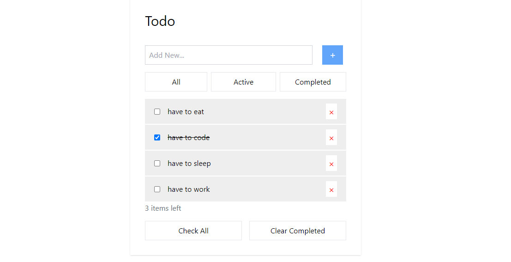

<h1>Step(1)=>Add servername,username,password in connect_db.php</h1>
<h1>Step(2)=>Run index.php on localhost server and database and table will be created automatically.</h1>
<h1>Step(3)=>'To Do Lists' with php,api,tailwind and alpine js can be tested</h1>
<h1>Todo-Alphine-Tailwind-PHP Preview Image</h1>

